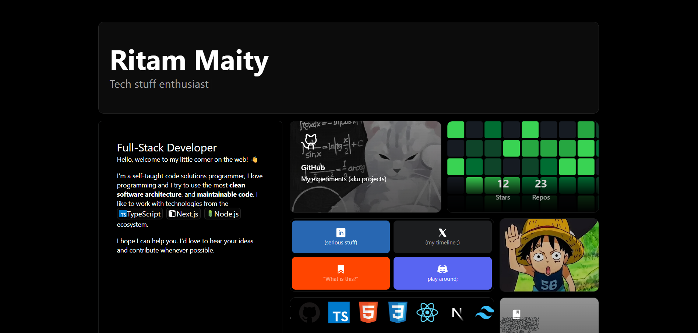

# My Portfolio Website

A modern, responsive portfolio website built with Next.js 14, TypeScript, and TailwindCSS. This portfolio showcases my projects, skills, and professional journey through an elegant and interactive interface.



## 🌟 Features

- **Modern UI/UX**: Elegant bento grid layout with smooth transitions and animations
- **Responsive Design**: Fully responsive across all device sizes
- **Dynamic Content**: 
  - Interactive typewriter effect
  - Real-time GitHub statistics
  - Project showcase with live demos
  - Education timeline
  - Downloadable CV
- **Tech Stack Display**: Visual representation of skills and technologies
- **Social Links**: Easy access to professional profiles and contact information

## 🚀 Tech Stack

- **Framework**: Next.js 14
- **Language**: TypeScript
- **Styling**: TailwindCSS
- **Icons**: Phosphor Icons, Tabler Icons
- **Animations**: CSS Transitions
- **Integrations**: GitHub API
- **Deployment**: Vercel

## 🛠️ Installation & Setup

1. Clone the repository:
   ```bash
   git clone https://github.com/yourusername/portfolio.git
   cd portfolio
   ```

2. Install dependencies:
   ```bash
   npm install
   ```

3. Create a `.env.local` file in the root directory and add your GitHub token:
   ```env
   GITHUB_TOKEN=your_github_token
   ```

4. Start the development server:
   ```bash
   npm run dev
   ```

5. Open [http://localhost:3000](http://localhost:3000) in your browser

<<<<<<< HEAD
=======
## 📁 Project Structure

```
portfolio/
├── app/                   # Next.js app directory
├── components/           
│   ├── bentogrid/        # Main layout components
│   ├── icons/            # Custom icons and SVGs
│   └── ui/               # Reusable UI components
├── lib/                  # Utility functions
└── public/              # Static assets
```

## 🎨 Customization

1. **Personal Information**: Update your details in `app/page.tsx`
2. **Projects**: Modify the projects array in `app/projects/page.tsx`
3. **CV**: Replace `public/cv.pdf` with your own CV
4. **Social Links**: Update links in `components/bentogrid/grid/cards/links.tsx`
5. **GitHub Stats**: Configure GitHub integration in `lib/github.ts`

## 🚀 Deployment

This portfolio is optimized for deployment on Vercel:

1. Push your code to GitHub
2. Import your repository on [Vercel](https://vercel.com)
3. Add your environment variables
4. Deploy!

>>>>>>> eb02157bd73407f7c1b7582660f27444c3d0f48e
---

Built with 💻 by Ritam Maity
